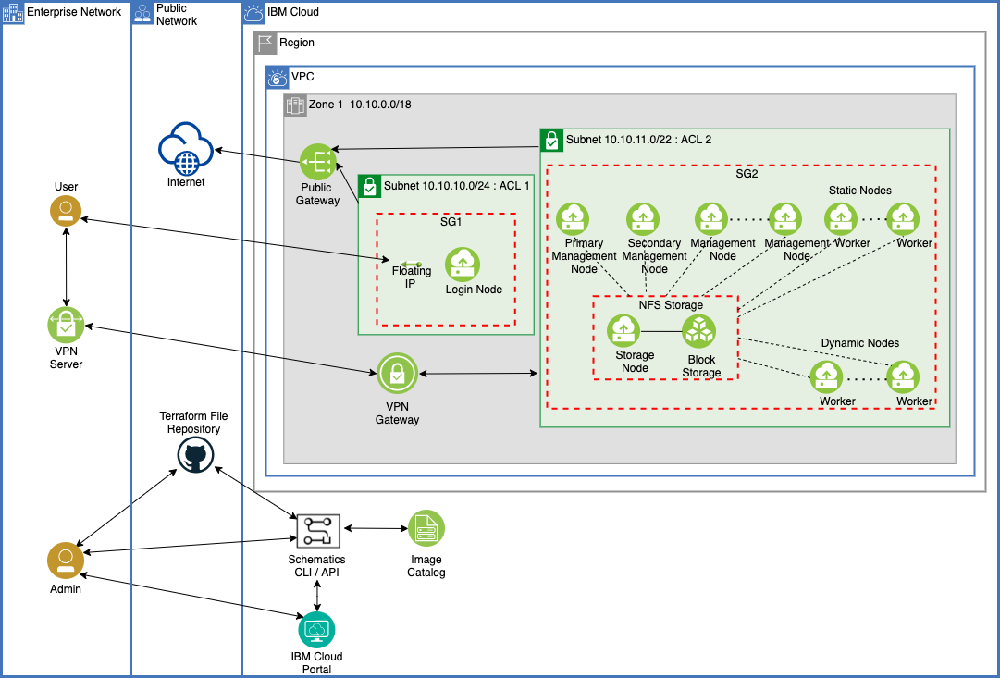

---

copyright:
  years: 2021, 2023
lastupdated: "2023-02-10"

keywords: 

subcollection: hpc-spectrum-symphony

---

{:shortdesc: .shortdesc}
{:codeblock: .codeblock}
{:screen: .screen}
{:external: target="_blank" .external}
{:pre: .pre}
{:tip: .tip}
{:note: .note}
{:important: .important}

# About the IBM Spectrum Symphony
{: #about-spectrum-symphony}

{{site.data.keyword.symphony_full_notm}} allows you to deploy high-performance computing (HPC) clusters by using {{site.data.keyword.symphony_full_notm}} as HPC scheduling software. This offering uses open source Terraform-based automation to provision and configure {{site.data.keyword.vpc_short}} resources. With simple steps to define configuration properties and use automated deployment, you can build your own HPC cluster in minutes by using your choice of an Intel x86 based [VPC virtual server instance profile type](/docs/vpc?topic=vpc-profiles&interface=ui) for the worker nodes in the cluster. {{site.data.keyword.symphony_full_notm}} also enables configuration for auto scaling so that the clusters can automatically add and remove worker nodes based on workload demand. It helps to take full advantage of consumption-based pricing and pay for cloud resources only when they are needed.
{: shortdesc}

{{site.data.keyword.symphony_full_notm}} offers the option of a public virtual system, or virtual systems that are deployed on dedicated hosts, for static compute nodes only. The management nodes and dynamic compute nodes use public virtual systems only. The dedicated host option allows you to have systems that are assigned just for your workloads and avoids issues like a noisy neighbor. The deployment properties allow you to either "pack" or "spread". You can pack a dedicated host to full capacity before spilling to another instance or spread the virtual server instances evenly across all dedicated hosts.

In addition, {{site.data.keyword.symphony_full_notm}} provides two shared storage options for you to manage your application data: NFS on block storage or Spectrum Scale. The Spectrum Scale option specifically works with static compute nodes only and allows you to deploy a high-performance file system with your HPC cluster.

The offering supports the Bring Your Own License (BYOL) model for [{{site.data.keyword.symphony_full_notm}}](https://www.ibm.com/products/analytics-workload-management){: external} and [{{site.data.keyword.scale_full_notm}}](https://www.ibm.com/products/spectrum-scale/pricing){: external} to deploy an HPC cluster on {{site.data.keyword.cloud_notm}}. Make sure that you have sufficient software licenses to deploy the required capacity on the {{site.data.keyword.cloud_notm}} cluster. For evaluation purposes, {{site.data.keyword.cloud_notm}} does enable limited access. Contact your {{site.data.keyword.cloud_notm}} sales or support team for evaluation licenses.

{{site.data.keyword.symphony_full_notm}} allows use of three interfaces: UI, API, and CLI. One UI option is the [{{site.data.keyword.cloud_notm}} catalog tile](https://cloud.ibm.com/catalog/content/terraform-1627942334-78300480-b376-4185-9812-b7ae00d82765-global){: external}. [Schematics](https://www.ibm.com/cloud/schematics){: external} also offers a UI, as well as API and CLI interfaces, and the Terraform-based automation code for use with {{site.data.keyword.bpshort}} is available in this [public GitHub repository](https://github.com/IBM-Cloud/hpc-cluster-symphony){: external}.

The offering enables initial {{site.data.keyword.symphony_short}}-based HPC cluster creation. Any updates that are needed post-deployment regarding {{site.data.keyword.symphony_short}} or Spectrum Scale configuration or setup must be performed by using Symphony and Scale tools and commands. If you use the {{site.data.keyword.bpshort}} interfaces to change the configuration properties and reapply those changes, you can cause disruptions to the running {{site.data.keyword.symphony_full_notm}} cluster. Restoring it back to a working state is difficult.
{: important}

## Architecture diagram
{: #architecture-diagram}

The following diagram depicts a {{site.data.keyword.symphony_short}} cluster that uses NFS for shared storage. For a view of a cluster that uses Spectrum Scale, see the [Using Spectrum Scale storage](/docs/hpc-spectrum-symphony?topic=hpc-spectrum-symphony-using-spectrum-scale-storage) section.

{: caption="Architecture diagram of an {{site.data.keyword.symphony_full_notm}} cluster on {{site.data.keyword.cloud_notm}}" caption-side="bottom"}
