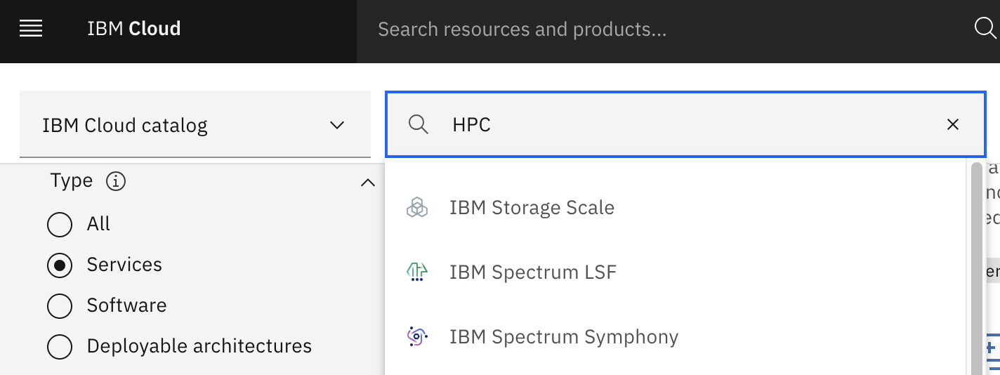
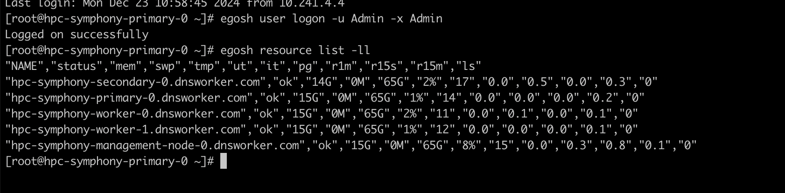
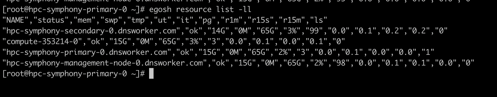

---

copyright: 
  years: 2024
lastupdated: "2024-12-24"

keywords: architecture overview, cluster access, symphony cluster
content-type: tutorial
services: virtual-servers, vpc, loadbalancer-service, fileshare, dns
account-plan: paid
completion-time: 60m
subcollection: hpc-spectrum-symphony

---

{:external: target="_blank" .external}
{:shortdesc: .shortdesc}
{:screen: .screen}
{:pre: .pre}
{:table: .aria-labeledby="caption"}
{:codeblock: .codeblock}
{:tip: .tip}
{:download: .download}
{:important: .important}
{:note: .note}
{:new_window: target="_blank"}
{:step: data-tutorial-type='step'}

# Setting up an {{site.data.keyword.symphony_full_notm}} cluster
{: #using-hpc-cluster} 
{: toc-content-type="tutorial"} 
{: toc-services="virtual-servers, vpc, loadbalancer-service"} 
{: toc-completion-time="60m"}

## Architecture overview and IBM file share setup
{: #sym-cluster-architecture-overview}

The HPC cluster consists of a login node, 1 - 3 Symphony management nodes, and a number of Symphony worker nodes.

* The login node is served as a jump host and it is the only node that has the public IP address. Other nodes have only private IP addresses and the only way to reach these nodes is through the login node. You can log in to the primary Symphony management host and do most of the operations from the Symphony management host. By default, lsfadmin is the only user ID created on the cluster. The SSH passwordless setup is configured between the Symphony management host and workers. You can reach any other worker node with the lsfadmin user ID from the Symphony primary.

* The worker node can be a static resource. In this case, its lifecycle is managed by Schematics. You can request a number of static worker nodes, and these workers remain available in the Symphony cluster until a Schematics-destroy action is performed. The Symphony resource connector function creates extra workers when there is not enough capacity to run jobs and destroys workers when the demands decrease. The lifecycle of these dynamic workers is managed by the Symphony resource connector. Wait until these dynamic resources are returned to the cloud before you destroy the entire VPC cluster through Schematics.

* The {{site.data.keyword.cloud_notm}} File Storage for VPC is used for file sharing. By default, there are three file share volumes; each is 100 GB. To change this configuration, [set the custom_file_shares deployment value](/docs/hpc-spectrum-symphony?topic=hpc-spectrum-symphony-deployment-values).

* The HPC cluster solution provides a base custom image, which includes the Symphony installation. You can create your own custom image on top of the base image. For more information, see [Create custom image](/docs/hpc-spectrum-symphony?topic=hpc-spectrum-symphony-getting-started-tutorial#create-custom-image). The image service on VPC provides a way for doing this. You can then specify the custom image that you want to use in Schematics for Symphony management nodes and worker nodes. The image that is used by the login node and the storage node is not configurable at the moment (CentOS 7 by default).

## Create SSH key
{: #sym-ssh-key-creation-before}
{: step}

Complete the following steps to create your SSH key:

1. Generate an SSH key on your system by running the following command: 

    ```
    ssh-keygen -t rsa
    ```
    {: pre}

2. Copy and save all the content from `.ssh/id_rsa.pub`.

## Add SSH key to the VPC infrastructure
{: #hpc-ssh-key-adding}
{: step}

1. Log in to the [{{site.data.keyword.cloud}} console](https://cloud.ibm.com/){: external} by using your unique credentials.
2. From the dashboard, click **Menu icon  > VPC Infrastructure > SSH keys**.
3. Click Create.
4. Enter the SSH key name (for example, `po-ibm-ssh-key`), select the default resource group, add tags, and select the region. 
5. Copy and paste the public key into the _Public key_ field (the contents that you saved from `.ssh/id_rsa.pub`).
6. Click Add SSH key.

## Create API key
{: #sym-api-key}
{: step}

Complete the following steps to create your API key:

1. In the {{site.data.keyword.cloud_notm}} console, go to **Manage > Access (IAM) > API keys**.
2. Click **Create an IBM Cloud API key**.
3. Enter a name and description for your API key.
4. Click Create.
5. Then click Show to display the API key, **Copy** to copy and save it for later, or click Download.

## Create and configure an HPC/Symphony cluster from the IBM Cloud catalog
{: #hpc-cluster-creation}
{: step}

Complete the following steps to create and configure an HPC cluster from the {{site.data.keyword.cloud_notm}} catalog:

1. In the {{site.data.keyword.cloud_notm}} catalog, search for _HPC_ or _Spectrum Symphony_, and then select {{site.data.keyword.symphony_full_notm}}. 

    {: caption="HPC cluster solution page"}

2. In the **Set the deployment values** section, supply the required values: `api_key`, `ibm_customer_number`, `remote_allowed_ips`, `ssh_key_name`, and `zone`. 

3. After you confirm with the license agreement, you can use the default values for other parameters and click Install. The HPC cluster is created and completed within 5 minutes with the default configuration.

### Parameters for cluster deployment
{: #hpc-cluster-deployment-parameters}

See the following table for a list of parameters that you can configure for your HPC cluster:

| Parameter | Description |
| --------- | ----------- |
| `cluster_prefix` | Prefix that is used to name the {{site.data.keyword.symphony_full_notm}} cluster and IBM Cloud resources that are provisioned to build the {{site.data.keyword.symphony_full_notm}} cluster instance. You cannot create more than one instance of the Symphony cluster with the same name. Make sure that the name is unique.|
| `custom_file_shares` | Mount points and sizes in GB and IOPS range of file shares that can be used to customize shared file storage layout. Provide the details for up to 5 shares. Each file share size in GB supports different range of IOPS. For more information, see [file share IOPS value](https://cloud.ibm.com/docs/vpc?topic=vpc-file-storage-profiles&interface=ui). |
| `hyperthreading_enabled` | Setting this to true will enable hyper-threading in the worker nodes of the cluster(default). Otherwise, hyper-threading will be disabled. |
| `image_name` | Name of the custom image that you want to use to create virtual server instances in your IBM Cloud account to deploy the {{site.data.keyword.symphony_full_notm}} cluster. By default, the automation uses a base image with additional software packages mentioned [here](/docs/hpc-spectrum-symphony#create-custom-image). If you would like to include your application-specific binary files, follow the instructions in [Planning for custom images](/docs/vpc?topic=vpc-planning-custom-images) to create your own custom image and use that to build the {{site.data.keyword.symphony_full_notm}} cluster through this offering. |
| `management_node_count` | Number of management nodes. This is the total number of primary, secondary and management nodes. There will be one Primary, one Secondary and the rest of the nodes will be management nodes. Enter a value in the range 1 - 10. |
| `region` | IBM Cloud zone name within the selected region where the {{site.data.keyword.symphony_full_notm}} cluster should be deployed. [Learn more](/docs/vpc?topic=vpc-creating-a-vpc-in-a-different-region&interface=cli#get-zones-using-the-cli).|
| `resource_group` |Resource group name from your IBM Cloud account where the VPC resources should be deployed. Note: Do not modify the "Default" value if you would like to use the auto-scaling capability. For additional information on resource groups, see [Managing resource groups](/docs/account?topic=account-rgs&interface=ui). |
| `vpc_name` | Name of an existing VPC in which the cluster resources will be deployed. If no value is given, then a new VPC will be provisioned for the cluster. [Learn more](https://cloud.ibm.com/docs/vpc). |
| `vpn_enabled` | Set the value as true to deploy a VPN gateway for VPC in the cluster. |
| `vpn_peer_address` | The peer public IP address to which the VPN will be connected.|
| `vpn_peer_cidrs` | Comma separated list of peer CIDRs (e.g., 192.168.0.0/24) to which the VPN will be connected.|
| `vpn_preshared_key` | The pre-shared key for the VPN. |
{: caption="Parameter values" caption-side="top"} 

### Parameters for auto scaling
{: #hpc-cluster-auto-scaling-parameters}

You can set the following parameters for auto scaling:

* `worker_node_min_count`: The minimum number of worker nodes that are provisioned at the time the cluster is created and remain running regardless of job demands in the cluster.

* `worker_node_max_count`: The maximum number of worker nodes in your HPC cluster, which limits the number of machines that can be added to HPC cluster. Symphony auto scaling scales up the cluster to this number of nodes when needed for your workloads and scales back for keeping onlyworker_node_min_count workers when no job is in the queues.

### Parameters for instance profiles
{: #hpc-cluster-instance-profiles-deployment-parameters}

You can control the instance profile for each instance type through the xxx_node_instance_type parameters. The management nodes are where the main Symphony daemons are running. You need to select ones with more compute power if you plan to run jobs by using 100+ nodes. The worker nodes are the ones where the workload execution takes place and the choice needs to be made according to the characteristic of workloads. The login instance is served as a jump host, so you can pick the smallest profile. For more information, see [Instance Profiles](/docs/vpc?topic=vpc-profiles&interface=ui).

## Accessing the HPC cluster
{: #hpc-cluster-access}
{: step}

To access your HPC cluster, complete the following steps:

1. Go to the **Menu icon  > Activity > Plan applied > View log**.

2. Copy `ssh-command` to access your cluster.

    * `ssh -J root@ip-jumphost root@ip-managementhost`

    * The `ip-jumphost` is public, while the `ip-managementhostis` not.

    * `-J flag`: Connects to the jump-host and establishes a TCP forwarding to the ultimate destination (management host).

## Auto scaling
{: #hpc-cluster-auto-scaling}
{: step}

You have a minimum number of worker nodes (`worker_node_min_count`). This is the number of worker nodes that are provisioned at the time the cluster is created. However, you can use a maximum number of worker nodes that should be added to the Spectrum Symphony cluster defined by `worker_node_max_count`. This is to limit the number of machines that can be added to Spectrum Symphony cluster when the auto scaling configuration is used. This property can be used to manage the cost associated with {{site.data.keyword.symphony_full_notm}} cluster instance.

The following example shows `worker_node_min_count=2` and `worker_node_max_count=2`.

1. To check the two static worker nodes, run the following command:

    ```
    egosh user logon -u Admin -x Admin
    egosh resource list -ll
    ```
    {: pre}

    Example output:

    {: caption="Two worker nodes"}

2. To try the auto scaling function, run a job that requires more than two nodes. For example, this job requires 10 jobs:

    ```
    symping -m 10
    ```
    {: pre}

3. The job is submitted.

4. After a minute, check the nodes by running the following command:

    ```
    egosh resource list -ll
    ```
    {: pre}
     
    You can see that now one node is added to your cluster:

    {: caption="One worker node added"}

5. The node that created by the auto scaling function are destroyed automatically after 1 hour of not being used.

## Set up hybrid connectivity (Optional)
{: #optional-hybrid-connectivity}
{: step}

If you want to set up a hybrid connectivity environment by using VPN, see the instructions [Installing a VPN to an HPC cluster](/docs/hpc-spectrum-symphony?topic=hpc-spectrum-symphony-install-vpn-hpc-cluster).

## Create DNS zones and DNS custom resolver
{: #dns-zones-custom-resolvers}
{: step}

 If you leave the `dns_instance_id` deployment input value as null, the deployment process creates a new DNS service instance ID in the respective DNS zone. Alternatively, provide an existing [IBM Cloud® DNS Service instance ID](/docs/hpc-spectrum-symphony?topic=hpc-spectrum-symphony-dns-custom-resolvers) for the `dns_instance_id` deployment input value.

If you leave the `dns_custom_resolver_id` deployment input value as null, the deployment process creates a new VPC and enables a new custom resolver for your cluster. Alternatively, to create custom DNS resolvers with an existing VPC, provide the resolver ID for the `dns_custom_resolver_id` deployment input value. For more information, see [DNS custom resolvers for your IBM Spectrum Symphony cluster](/docs/hpc-spectrum-symphony?topic=hpc-spectrum-symphony-dns-custom-resolvers).
