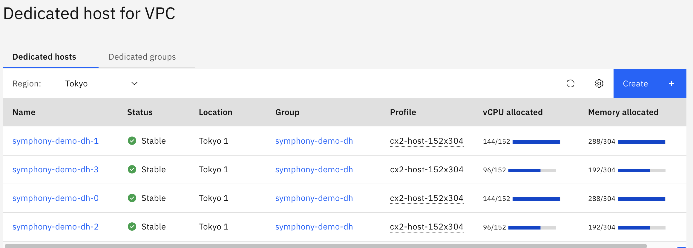

---

copyright:
  years: 2021, 2022
lastupdated: "2022-03-04"

keywords: 

subcollection: hpc-spectrum-symphony

---

{:shortdesc: .shortdesc}
{:codeblock: .codeblock}
{:screen: .screen}
{:external: target="_blank" .external}
{:pre: .pre}
{:tip: .tip}
{:note: .note}
{:important: .important}
{:ui: .ph data-hd-interface='ui'}
{:cli: .ph data-hd-interface='cli'}
{:api: .ph data-hd-interface='api'}
{:table: .aria-labeledby="caption"}

# Using dedicated hosts
{: #using-dedicated-hosts}

Dedicated hosts enable you to deploy your virtual server instances on single-tenant compute hosts. Workloads under dedicated hosts can avoid noisy neighbor issues (for example, performance interference due to other users' workloads) that they might encounter on public virtual server instances. When you use a dedicated host, you are billed by the usage of the host, not vCPUs or RAM associated with your virtual instances.

This offering can deploy static compute nodes on dedicated hosts. The number of dedicated hosts and the profile names for dedicated hosts are calculated from `worker_node_min_count` and `worker_node_instance_type`. 

Symphony still dynamically provisions compute nodes as public instances and dedicated hosts are used only for static compute nodes provisioned at the time that the cluster is created.
{: note}

## Before you begin
{: #before-you-begin}

Before you begin, make sure to complete the steps for [Getting started with {{site.data.keyword.symphony_full_notm}}](/docs/hpc-spectrum-symphony?topic=hpc-spectrum-symphony-getting-started-tutorial).

## How to configure
{: #how-to-configure}

Set two variables for dedicated hosts when you [create your workspace](/docs/hpc-spectrum-symphony?topic=hpc-spectrum-symphony-creating-workspace). You need to set ``dedicated_host_enabled`` to be true and ``dedicated_host_placement`` to be spread or pack (spread is default).

The variable ``dedicated_host_placement`` specifies the placement policy for static workers. The pack option deploys instances on one dedicated host until full before moving on to the next dedicated host. The spread option deploys instances in round-robin fashion across all the dedicated hosts. The second option should result in a mostly even distribution of VSIs on the hosts, while the first option could result in one dedicated host being mostly empty.

## Example
{: #example}

``cluster_prefix            = symphony-demo
worker_node_min_count     = 10
worker_node_instance_type = cx2-48x96
dedicated_host_enabled    = true
dedicated_host_placement  = spread``

With theses variables, ten cx2-48x96 instances are provisioned as static compute nodes on four dedicated hosts with cx2-host-152x304. The dedicated host profile is automatically selected. You can see provisioned dedicated hosts with ibmcloud CLI or Web Console UI for {{site.data.keyword.cloud_notm}}.

## Dedicated host for VPC
{: #how-to-configure}

{: caption="Dedicated host for VPC {{site.data.keyword.cloud_notm}}" caption-side="bottom"}

The ``spread`` placement policy tries to evenly distribute worker nodes and so symphony-demo-dh-1 and symphony-demo-dh-2 consumed 144 vCPUs (48 * 3 VSIs), and symphony-demo-dh-3 and symphony-demo-dh-4 consumed 96 vCPUs (48 * 2 VSIs). If you used the pack placement, it would allocate three VSIs on three dedicated hosts and one VSI on the fourth dedicated host.
